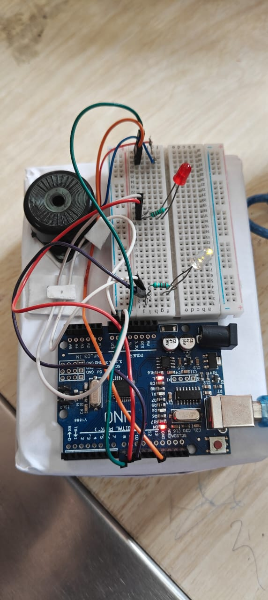
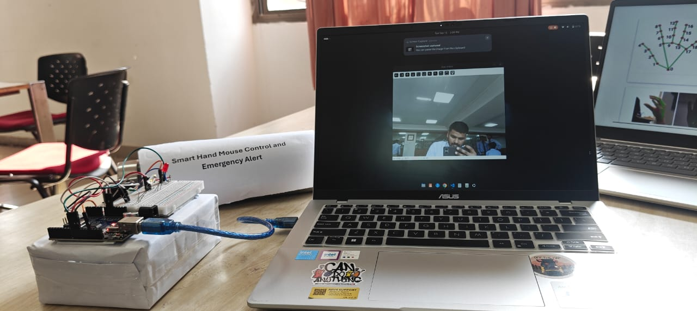

# Smart Hand Mouse Control System

A touch-free computer control system using hand gestures, combined with an Arduino-based emergency alert module.

## Features

- Hand gesture based cursor control
- Single click and double click
- Scroll control
- Screenshot using a held fist gesture
- Arduino-based emergency alert
- Red LED and buzzer during emergency
- Green LED indicates normal mode
- Serial communication between Python and Arduino

## Technologies Used

- Python
- OpenCV
- MediaPipe
- PyAutoGUI
- PySerial
- Arduino
- Serial Communication

## How It Works

The webcam captures the user's hand and OpenCV processes the video frames.

MediaPipe detects hand landmarks and identifies different gestures.

PyAutoGUI converts the detected gestures into computer actions such as:

- Cursor movement
- Clicking
- Double clicking
- Scrolling
- Screenshot capture

For the emergency feature, a specific hand gesture is held for one second. Python sends the character `E` to the Arduino through serial communication.

The Arduino then:

1. Turns off the green LED
2. Turns on the red LED
3. Activates the buzzer
4. Keeps the alert active for 10 seconds
5. Returns to normal mode

## Hardware

- Arduino UNO
- Buzzer
- Red LED
- Green LED
- 220 ohm resistors
- Breadboard
- Jumper wires
- USB cable

## Arduino Pin Configuration

| Component | Arduino Pin |
|---|---|
| Buzzer | D8 |
| Red LED | D9 |
| Green LED | D10 |

## Python Setup

Create and activate a virtual environment:

```bash
python3.10 -m venv gesture_env
source gesture_env/bin/activate
```

## Project Images

### Project Setup



### Arduino Emergency Alert Hardware


